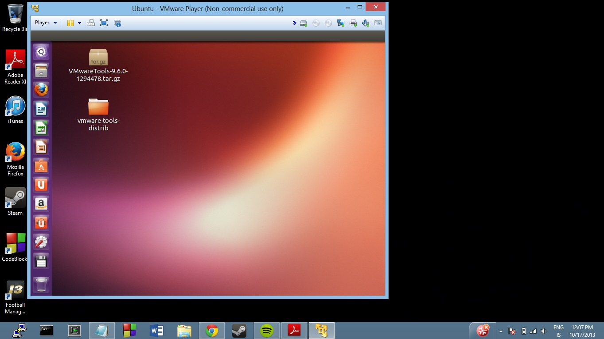

#Open Source

* Benedikt Valur Árnason

## 1. Linux uppsetning

Eftir að hafa náð í virtual box og ubuntu 13.04 og ekki náð að setja það upp.  Náði ég í VMWare Player og setti 
Ubuntu upp þar.  Það gekk fínt. Hér er mynd
Ef það ekki að opna þessa mynd þá er hér [imgur][4] linkur.
[4]: http://imgur.com/giGFbj6 "imgur"

## 2. Uppsetning á vim && git

Það gekk vel að sækja þessi tól.

## 3. Unnið með Git (1. hluti)

Ég fór eftir leiðbeiningunum í verkefnalýsingunni.  Breytingin sem ég gerði á .cpp skránni var sú að ég bætti
við cout skipun efst í main() fallinu.  Hún prentaði út nafnið mitt og ru notendanafn.  Ég lenti svo ekki í
neinum vandamálum fyrr en ég átti að gera "git push origin master".  Þá þurfti ég að gera "git config --global user.email "benedikta13@ru.is"".
Það var held ég vegna þess að tölvan hélt að mailið væri benedikta13@ubuntu.  En þetta virkaði og ég gat klárað
þennan lið annars mjög auðveldlega.

Hér er linkurinn á verkefnið inná [github][1]
[1]: https://github.com/benedikta13/INTOPrufa "github"

## 4. Uppsettur hugbúnaður

<table>
  <tr>
    <th>Name</th><th>License</th><th>SourceCode</th>
  </tr>
  <tr>
    <td>LibreOffice Writer</td><td>GNU Lesser General Public License</td><td>[Clone: $ git clone git://anongit.freedesktop.org/libreoffice/core]</td>
  </tr>
  <tr>
    <td>EOG image viewer</td><td>GNU General Public License</td><td>[https://code.launchpad.net/eog]</td>
  </tr>
  <tr>
    <td>Shotwell Photo Manager</td><td>GNU LGPL v2.1</td><td>[http://www.yorba.org/download/geary/0.4/geary-0.4.0.tar.xz]</td> 
  </tr>
</table>

## 5. Unnið með Git (2. hluti)

Hér þurfti ekkert að gera
